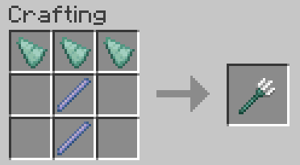
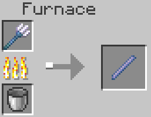

# Improved Tridents (datapack)

This datapack adds sensible improvements to the [Trident](https://minecraft.wiki/w/Trident) to make it a viable melee and ranged weapon adjacent to the Sword.

__Requires__: Minecraft 1.21.x +

All enchants added are completely unmodified - except for [Loyalty](https://minecraft.wiki/w/Loyalty), which has a ~10-30% (scaling on enchant level) faster recall to hand when thrown.

It also adds a fairly balanced crafting recipe requiring:

- 2 x [Breeze Rods](https://minecraft.wiki/w/Breeze_Rod) and
- 3 x [Prismatic Shards](https://minecraft.wiki/w/Prismarine_Shard)

Additionally, one trident is smeltable into 1 [Breeze Rod](https://minecraft.wiki/w/Breeze_Rod).

For more detail, see [Changes & TODO](#changes-todo) (below)!

## __Install__

Simply download the zip archive from [Releases](https://github.com/Euheimr/Improved-Tridents/releases) and extract the archive directly to `datapacks` folder within your world.

<h2 id="changes-todo">Changes & TODO</h2>

1. [DONE] __Craftable Tridents__ - 3 [Prismatic Shards](https://minecraft.wiki/w/Prismarine_Shard) + 2 [Breeze Rods](https://minecraft.wiki/w/Breeze_Rod)

    

2. [DONE] __Smeltable Tridents__ - a single trident smelts into 1 [Breeze Rod](https://minecraft.wiki/w/Breeze_Rod)

    

3. [PARTIAL] __Enchantments__

    - [x] [Looting](https://minecraft.wiki/w/Looting) - mobs to drop more items and increases the chances of rare drops
    - [x] [Loyalty](https://minecraft.wiki/w/Loyalty) - has 30% faster recall-to-hand
    - [x] [Fire Aspect](https://minecraft.wiki/w/Fire_Aspect) - melee attack sets attacked targets on fire
    - [x] [Knockback](https://minecraft.wiki/w/Knockback) -  increases melee knockback
    - [ ] [Piercing](https://minecraft.wiki/w/Piercing)__1__ - arrows / projectiles to pass through entities
    - [ ] [Impaling](https://minecraft.wiki/w/Impaling)__1__ __2__ - deal extra damage on each hit against aquatic mobs __and wet mobs (in water/rain)__
    - [x] [Sharpness](https://minecraft.wiki/w/Sharpness)__2__ - increases melee __and ranged/thrown__ damage
    - [x] [Smite](https://minecraft.wiki/w/Smite)__2__ - increases damage to undead mobs (Bogged, Drowned, Husk, Phantom, Skeleton, Wither, Wither Skeleton, Zoglin, Zombie, Zombie Villager, Zombified Piglin)
    - [x] [Bane of Arthropods](https://minecraft.wiki/w/Bane_of_Arthropods)__2__ - increases damage to arthropod mobs (spiders, cave spiders, bees, silverfish, and endermites)

    __1__ *__Piercing__ may not be applied with __Impaling__*

    __2__ *Only __one__ of these enchantments may be applied*

4. [ ] [Loyalty](https://minecraft.wiki/w/Loyalty) enchanted tridents return from the Void

5. [ ] [Trident](https://minecraft.wiki/w/Trident) returns to inventory slot it was thrown from
   - __Note__: tag the trident when thrown, then run an if command to check if the tag exists and send it to that slot / offhand

6. ~~__Repairable Tridents__ - use breeze rod(s) to add durability~~  - __Cannot add recipes to Anvil :(__

7. ~~__Combat Tests update__(unreleased experimental snapshot in 2019/2020 - [official wiki link](https://minecraft.wiki/w/Java_Edition_Combat_Tests))~~:

    __Not possible__ to change item base stats globally in a datapack :(

    __This functionality does not exist for datapacks__ *The enchantment changes might be doable though!*

   - ~~__Base Damage__:     9  -> 7 ~~
   - ~~__Attack speed__:    1.1 -> 2.0~~
   - ~~__Attack Range__:    3 blocks -> 3.5 blocks~~
   - __Enchantments__:
        - __Impaling__: Applies to all wet mobs (in water / rain) as well as aquatic mobs
        - __Loyalty__: tridents thrown to the void (the End) always return to their owner

---

---

<h2 id="dev">Developer's Area</h2>

### Datapack Definitions

- [Data Pack](https://minecraft.wiki/w/Data_pack#Contents)
- [Tag](https://minecraft.wiki/w/Tag)
  - __Purpose__: group different game elements together (also called registry tags)
  - __Path__: `data/<namespace>/tags/function/<name>.json` ...
    - not limited to `function`... can use `block`, `item` etc ...
- [Loot table](https://minecraft.wiki/w/Loot_table)
  - __Path__: `data/<namespace>/loot_table/<name>.json`
  - "Vanilla loot tables are grouped into categories with some tables being in subfolders of those"
    - __Ie.__ - the file for zombies would go in: `<data pack name>/data/minecraft/loot_table/entities/zombie.json`. This makes every zombie in that world use the datapack's loot table rather than the default zombie loot table.
- [Loot context](https://minecraft.wiki/w/Loot_context)
  - __Purpose__: set of parameters available to [loot tables](https://minecraft.wiki/w/Loot_table), [predicates](https://minecraft.wiki/w/Predicate), [item modifiers](https://minecraft.wiki/w/Item_modifier), and number providers. Used to determine if a given [loot table](https://minecraft.wiki/w/Loot_table) or predicate is valid to that use case, allowing this check to be done when the [data pack]((https://minecraft.wiki/w/Data_pack)) is loaded, rather than at runtime
- [Item modifier](https://minecraft.wiki/w/Item_modifier)
  - __Purpose__: apply modifications to item stacks, such as adjusting the stack size or adding enchantments
  - __Path__: `data/<namespace>/item_modifier/<name>.json`
- [Attribute->Modifiers](https://minecraft.wiki/w/Attribute#Modifiers)
  - __Purpose__: values that determine certain properties of mobs, armor stands, and players. Attributes also have modifiers that adjust the strength of their effects
- [Predicates (requirements)](https://minecraft.wiki/w/Predicate)
  - __Purpose__: check conditions within the world
- [Enchantments definitions](https://minecraft.wiki/w/Enchantment_definition)
  - __Path__: `data/<namespace>/enchantment`
  - __Example Implementation__: https://assets.mcasset.cloud/1.21.4/data/minecraft/enchantment/looting.json
- [Recipes - shaped crafting](https://minecraft.wiki/w/Tutorial:Creating_a_data_pack#Shaped_crafting)
  - __Path__: `data/<namespace>/recipe`
- [Function (Java Edition)](https://minecraft.wiki/w/Function_(Java_Edition))
  - __Path__: `data/<namespace>/function`
  - __Path->Tag__: `data/namespace/tags/function/load.json|tick.json`
  - [Commands](https://minecraft.wiki/w/Commands#Available_in_Java_Edition)

### Item/Entity Info

- [Bow->arrows](https://minecraft.wiki/w/Bow#Arrows)
- [Water->Data values](https://minecraft.wiki/w/Water#Data_values)

### Vanilla functionality

---

#### Base attributes

  |                Name               |          Value          |
  |:---------------------------------:|:-----------------------:|
  | Base Damage (melee)               | 9  |
  | Base Damage (range)               | 8  |
  | Attack Range                      |         3 blocks        |
  | Base Durability                   |           250           |
  | Attack speed (melee)              |           1.1           |
  | Attack speed (range, Loyalty III) | 30 blocks/s return time |

#### Enchants - [wiki link](https://minecraft.wiki/w/Trident#Enchantments)

  |    Name     |                                                 Description                                                 | Max Level  |          Method           | Weight  |
  |:-----------:|:-----------------------------------------------------------------------------------------------------------:|:----------:|:-------------------------:|:-------:|
  | Loyalty**    | Causes the trident to return after landing. (10, 20, 30 blocks per level respectively)                                    | III        |    | 5       |
  | Channeling** | Releases a bolt of lightning when the thrown trident strikes a mob or lightning rod during a thunderstorm.  | I          |    | 1       |
  | Riptide**    | Replaces the throw with a charge that hurls the user forward ONLY when wet.                                 | III        |    | 2       |
  | Impaling    | Increases the damage dealt to aquatic‌ mobs.                                                                 | V          |    | 2       |
  | Unbreaking  | Grants a chance to negate durability consumption.                                                           | III        |    | 5       |
  | Mending     | Repairs the trident when obtaining experience.                                                              | I          |                     | 2       |

** *__Loyalty__ and __Channeling__ are incompatable with __Riptide__*

##### __Impaling (damage/level)__ - [wiki link](https://minecraft.wiki/w/Trident#Impaling_damage)

*Only affects all __aquatic__ mobs*

| Level  |      Increase       |      Melee      |     Ranged     |
|:------:|:-------------------:|:---------------:|:--------------:|
|   I    |  adds 2.5 (×1.25)  |  11.5 (×5.75)  | 10.5 (×5.25)  |
|   II   |       adds 5      |    14 (×7)     |   13 (×6.5)   |
|  III   |  adds 7.5 (×3.75)  |  16.5 (×8.25)  | 15.5 (×7.75)  |
|   IV   |      adds 10      |   19 (×9.5)    |    18 (×9)    |
|   V    | adds 12.5 (×6.25)  | 21.5 (×10.75)  | 20.5 (×10.25) |
